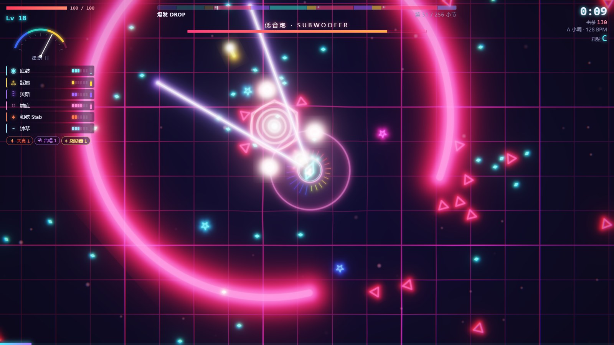
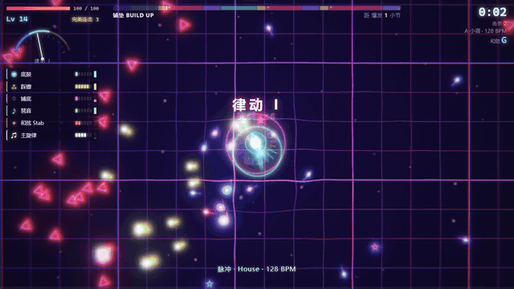
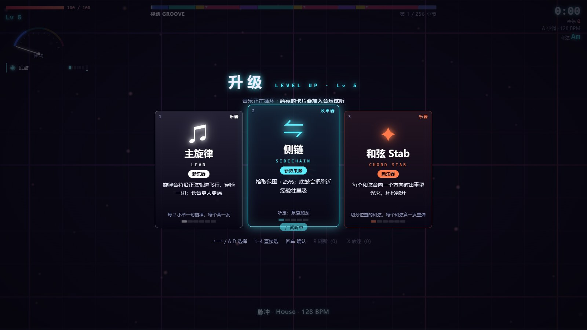
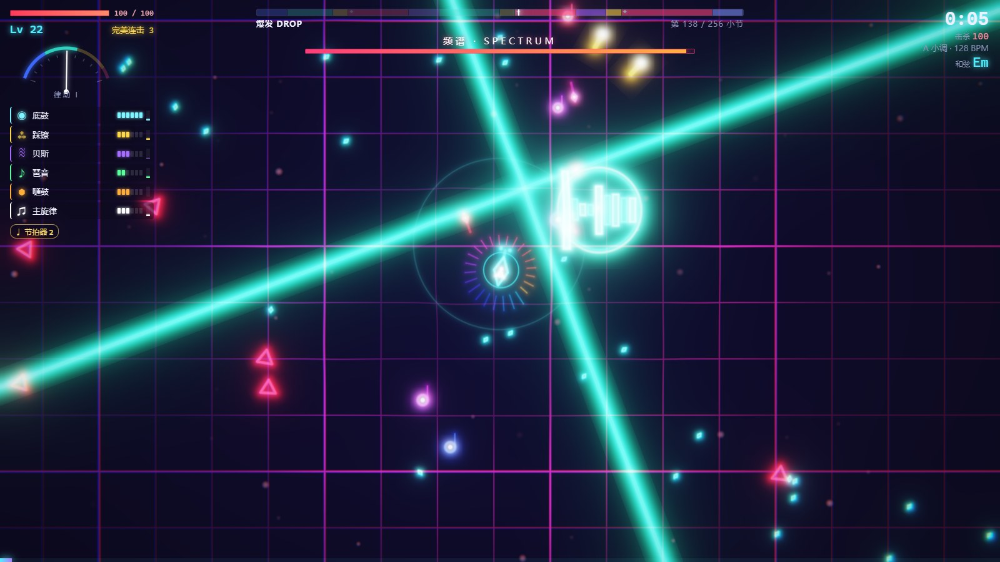
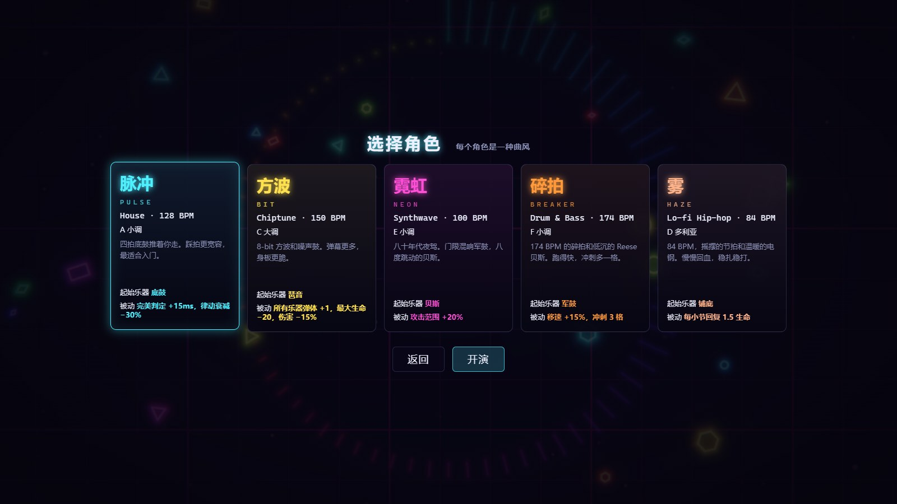
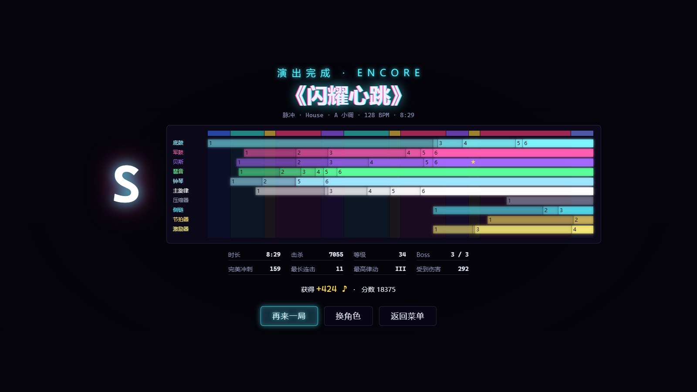

# 节拍幸存者

> 每件武器都是一件乐器，每一次攻击都踩在节拍上。一局 8 分钟，打完就是一首由你的 build 写出来的电子乐。

**▶ 在线玩：<https://beat.xiaoming6680.link>** · 电脑浏览器（Edge / Chrome）+ 键盘或手柄，建议戴耳机 · 一局约 8 分钟

## 这是什么

类《吸血鬼幸存者》的割草游戏：你只管走位和踩拍冲刺，乐器会自己按节拍开火。底鼓放冲击波、踩镲连射、琶音发追踪音符、贝斯射激光……选了什么、升到几级、带什么效果器，都会直接变成你耳朵里那首歌的一部分。

## 玩起来是这样

| | |
|---|---|
|  |  |
| **升级时音乐不停**：循环当前这一小节，高亮哪张卡，就先把它加进音乐里让你试听 | **Boss 招式踩在拍子上**：提前一拍预警，拍点上落下，可以听着躲 |
|  |  |
| **五个角色 = 五种曲风**：House、Chiptune、Synthwave、Drum & Bass、Lo-fi，各有自己的 BPM、调式和音色 | **一局一首歌**：结算是这首歌的编曲视图，还能在唱片架重放、导出 WAV |

## 怎么玩

| 操作 | 键位 |
|------|------|
| 移动 | WASD / 方向键 |
| 冲刺（冲刺中无敌） | 空格 / Shift，**在拍点上按 = 完美冲刺** |
| 选升级 | ←→ / A D 挑选，回车确认，或直接按 1–4 |
| 刷新 / 放逐卡片 | R / X（次数在工作室解锁） |
| 暂停 | Esc / P |

也支持手柄：左摇杆移动、A 冲刺、Start 暂停。

- **完美冲刺**：踩准拍点不消耗充能，还会放一圈冲击波；踩准了可以每拍一冲。
- **律动值**：完美冲刺和击杀让它上涨、被打会掉；越高伤害越高，音乐里也会多出新的层。
- **效果器 = 被动**：失真、混响、延迟、合唱……既改数值，也真的改整首歌的混音。满级乐器配上对应效果器，能从宝箱里开出 **Remix** 进化。
- **曲式就是关卡**：铺垫段敌人合围、倒数三拍；Drop 那一拍全屏清场、Boss 进场；回落段喘口气、打精英拿宝箱。击败终极 Drop 的指挥家就通关。
- **局外成长**：每局赚“音符 ♪”，在工作室买永久强化、解锁新角色和乐器。

## 小贴士

- 戴蓝牙耳机总觉得踩不准：去 **设置 → 延迟校准**，跟着节拍按几下空格。
- 后期满屏特效看不清：**设置 → 玩家特效** 调低；对闪光敏感：**设置 → 闪光 → 减弱**。
- 想离线玩：下载这个仓库，双击 `index.html` 就行，不用安装任何东西。

## 更多小游戏

- [铭刻卡带库](https://play.xiaoming6680.link)：所有小游戏的入口
- [别关我](https://stay.xiaoming6680.link)
- [从一个点开始](https://dot.xiaoming6680.link)

开发说明见 [docs/](docs/)。
